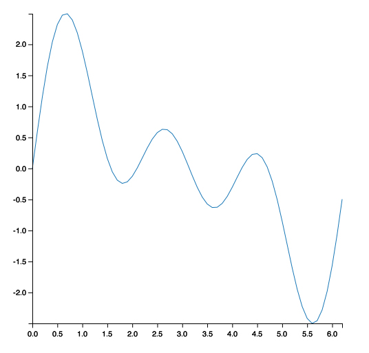

VGPlot.jl
=========

# NOTICE

**This package is unmaintained. Its reliability is not guaranteed.**

# Introduction

Everyone loves ggplot2. This package imitates the simplest features from ggplot2 in Julia by using the Vega.jl package to turn Julia data structures into Vega visualization specs.

This is a very early draft. In the long run, this package is likely to be superceded by Gadfly, although this may continue to be the only Julia package that is capable of producing Vega specifications as output.

For now, it provides some useful graphical abstractions that are otherwise missing from Julia.

# Usage Examples

Here are some very simple examples of VGPlot that operate at the limits of what this early draft release can do:

	using VGPlot

	df = DataFrame()
	df["x"] = 0.0:0.1:(2.0 * pi)
	df["y"] = sin(df["x"]) + sin(2 * df["x"]) + sin(3 * df["x"])

	vgplot(df)

	vgplot(df) + geom_point()

	vgplot(df) + geom_line()

	vgplot(df) + geom_point() + geom_line()

	vgplot(df) +
	  geom_point(size = 10.0, shape = "diamond") +
	  geom_line()

	vgplot(df) +
	  geom_point(size = 25.0, shape = "cross") +
	  geom_line()

	using RDatasets

	iris = data("datasets", "iris")
	clean_colnames!(iris)

	v = vgplot(iris,
		       x = "Sepal_Length",
		       y = "Sepal_Width",
		       group = "Species")

	v = v + geom_point()

	v = v + geom_line()

